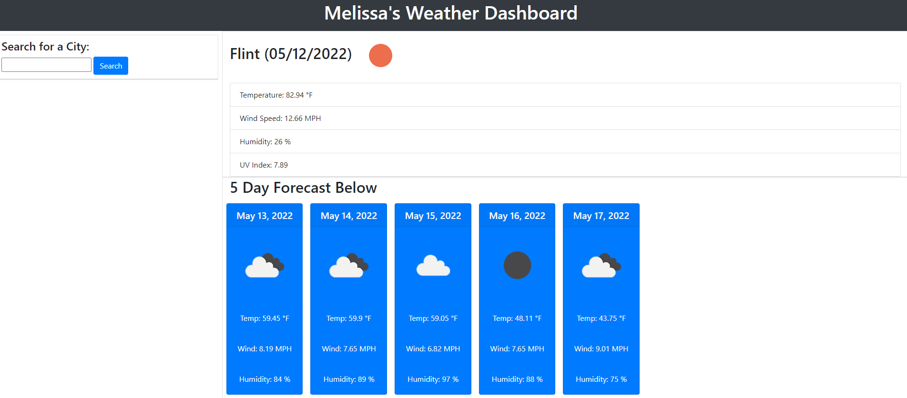

# WeatherDashboard

## Description

Interactivew web page that allows user to view the weather outlook for any city so that the traveler can plan his or her trip accordingly. 

Webpage has city input and is presented with current and 5 day forecast for that particular searched city. When weather conditions are searched, user is shown city name, current date, an icon representing weather conditions, temperature, humidity, wind speech, and UV index. 

Additionally the UV Index changes color to indicate whether the conditions are green for favorable (<=2>), yellow for moderate (2 or <=8), or red for severe (>8).

## Used in Webpage

The HTML, CSS, and JavaScript files used to create this webpage utilize sources from open weather APIs, specifically current weather conditions, UV index, and 5 day forecast. Additionally bootstrap is used and moment.JS APIs in order to pull in current time. The [OpenWeather One Call API](https://openweathermap.org/api/one-call-api) was used to retrieve weather data for cities.

Inputs for searched cities are saved in local storage.

## Screenshot

The below screenshot shows final version of webpage. Screenshot shows currentw weather conditions and 5 day forecast for Flint.

## Links

Published Site: https://deven1991.github.io/WeatherDashboard/
GitHub: https://github.com/Deven1991/WeatherDashboard.git